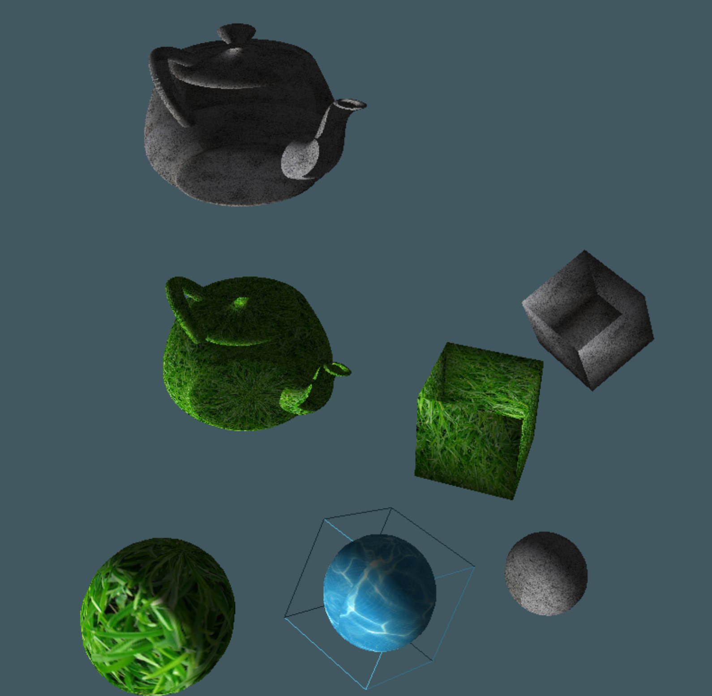

# Simple Modelling System

## OpenGl/GLUT and C++ simple modeler repo

This program uses ray picking to select objects and move them around on a plane. Said objects can be customized with textures and different kinds of materials. 



The following code snippet displays the commands:

```
------------------------------------------
-----------      COMMANDS      -----------
------------------------------------------
------------------------------------------
Shapes
'b' --> insert cube 					  
'n' --> insert sphere 					  
'm' --> insert cone 					  
',' --> insert torus 					  
'.' --> insert teapot 					  
------------------------------------------
'q' --> translate x 					  
'ALT + q' --> translate negative x 		  
'w' --> translate y 					  
'ALT + w' --> translate negative y 		  
'e' --> translate z 					  
'ALT + e' --> translate negative z 		  
------------------------------------------
'r' --> rotate x 						  
'ALT + r' --> rotate negative x 		  
't' --> rotate y 						  
'ALT + t' --> rotate negative y 		  
'y' --> rotate z 						  
'ALT + y' --> rotate negative z 		  
------------------------------------------
'u' --> scale x 						  
'ALT + u' --> scale negative x 			  
'i' --> scale y 						  
'ALT + i' --> scale negative y 			  
'o' --> scale z 						  
'ALT + o' --> scale negative z 			  
------------------------------------------
Materials
'1' --> apply chrome material 			  
'2' --> apply ruby material 			  
'3' --> apply emerald material 			  
'4' --> apply obsidian material 		  
'5' --> apply gold material 			  
------------------------------------------
Textures
'6' --> apply grass texture				  
'7' --> apply stone texture				  
'8' --> apply water texture				  
'd' --> disable object texture            
'D' --> enable object texture             
------------------------------------------
'g' and 'G' change position of 1st light  
'h' and 'H' change position of 2nd light  
'l' --> load scene from save_file.txt	  
's' --> save scene to save_file.txt	      
------------------------------------------
------------------------------------------
'f' --> reset scene 					  
'Q' --> quit program 	 				  
Left click to select object				  
Right click to delete object			  
------------------------------------------
------------------------------------------
```
